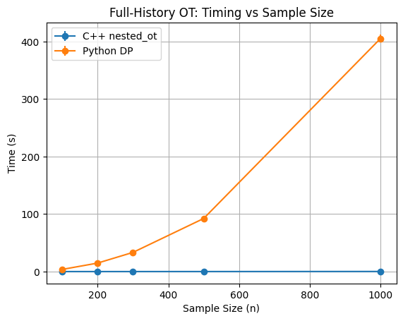
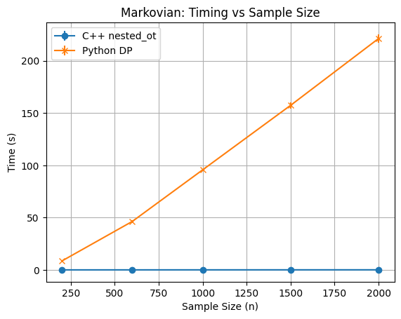

# NestedOT  
**Nested Optimal Transport** (a.k.a. Adapted Wasserstein)  
Fast, exact C++ solver for discrete nested OT via backward induction—unmatched performance.

---

## Introduction  
This is an optimized framework to compute the nested distance.  
It computes exactly every discrete-time, discrete-state optimal transport problem.  
It can also be used to approximate the adapted distance between discrete-time processes with continuous densities by discretizing the state space (following the approach in Backhoff et al. 2022).

---

## How to Install  
_TO BE WRITTEN_

---

## Notebooks  
- **demo.ipynb**: Usage examples and walkthrough of common tasks  
- **solver_explain.ipynb**: Detailed explanation of the underlying C++ solver  
- **example_of_use.ipynb**: Estimating the adapted Wasserstein distance for continuous measures in discrete time

---

## Why NestedOT?  
The only other publicly available implementations of exact discrete adapted OT (e.g., [stephaneckstein/aotnumerics](https://github.com/stephaneckstein/aotnumerics)) become utterly infeasible beyond very small sample sizes. **NestedOT** closes that gap, delivering:

- **→ Over 1000× speed-up** on both non-Markovian and Markovian problems  
- **→ Scales to thousands of samples** in seconds  
- **→ C++ core with Python bindings** for seamless integration  

---

## Performance Comparison: Non-Markovian

We compare **NestedOT’s** C++ `nested_ot` solver against the pure-Python dynamic-programming reference (`solve_dynamic`) for the **non-Markovian** case.

- **Problem setup**  
  - Sample sizes: **100, 200, 300, 500, 1000**  
  - **5 runs** each  
  - Matrices  
    \[
      L = \begin{pmatrix}
        1 & 0 & 0 & 0\\
        2 & 2 & 0 & 0\\
        1 & 1 & 3 & 0\\
        2 & 2 & 1 & 2
      \end{pmatrix},\quad
      M = \begin{pmatrix}
        1 & 0 & 0 & 0\\
        2 & 1 & 0 & 0\\
        3 & 2 & 1 & 0\\
        4 & 3 & 2 & 1
      \end{pmatrix}
    \]
  - Grid size \(\delta = 0.2\), cost exponent \(p=2\)  
  - **Backward induction** on the full-history DAG  

| Sample \(n\) | C++ time (mean ± std) [s] | Py DP time (mean ± std) [s] | Speed-up (×)    |
|-------------:|:-------------------------:|:--------------------------:|:---------------:|
| 100          | 0.040 ± 0.011              | 1.866 ± 0.061               | 46.5×           |
| 200          | 0.024 ± 0.010              | 7.490 ± 0.194               | 317.5×          |
| 300          | 0.015 ± 0.004              | 17.061 ± 0.457              | 1124.9×         |
| 500          | 0.019 ± 0.000              | 48.557 ± 0.897              | 2543.1×         |
| 1000         | 0.067 ± 0.014              | 221.924 ± 4.303             | 3292.6×         |



> **Over three orders of magnitude** faster than any existing public code—and the gap **widens** with larger samples.

---

## Performance Comparison: Markovian

We compare **NestedOT’s** C++ `nested_ot` solver against the Python dynamic-programming reference (`solve_dynamic`) for the **Markovian** case.

- **Time steps**: \(T = 10\)  
- **Runs per size**: 5  
- **Sample sizes**: [200, 600, 1000, 1500, 2000]  
- **Grid size**: \(\delta = 0.1\)  
- **Cost exponent**: \(p = 2\)  
- **OpenMP threads**: 20  
- **Path generation**: integrated-process (variance 0.25) and AR(1) (\(\phi = 0.8\), \(\sigma = 1.0\))

| Sample \(n\) | C++ time (mean ± std) [s] | Py DP time (mean ± std) [s] | Speed‑up (×)    |
|-------------:|:-------------------------:|:--------------------------:|:---------------:|
| 200          | 0.007 ± 0.000              | 8.531 ± 0.187               | 1224.3×         |
| 600          | 0.022 ± 0.001              | 46.357 ± 0.982              | 2120.2×         |
| 1000         | 0.036 ± 0.000              | 95.701 ± 0.924              | 2637.6×         |
| 1500         | 0.052 ± 0.001              | 157.432 ± 2.981             | 3002.5×         |
| 2000         | 0.069 ± 0.001              | 221.344 ± 4.013             | 3215.8×         |



---

## Citation

```bibtex
@article{backhoff2022,
  author    = {Backhoff, Julio and Bartl, Daniel and Beiglböck, Mathias and Wiesel, Johannes},
  title     = {Estimating processes in adapted Wasserstein distance},
  journal   = {The Annals of Applied Probability},
  volume    = {32},
  number    = {1},
  pages     = {523--553},
  year      = {2022},
  doi       = {10.1214/21-AAP1687}
}

